# P3-behavioral-cloning
Behavioral cloning project - part of the Self Driving Car Engineer Nanodegree

## Prerequisites
* Python 3.5
* [Anaconda](https://www.continuum.io/downloads)
* Udacity's Self Driving Car simulator

### Training
Training requires data generated using the simulator:
- Images under the IMG directory
- driving_log.csv file with the training data

To start the training:
* Create the environment from the .yml file: `conda env create -f environment.yml`
* Activate the environment: `source activate drive`
* Run `python train.py`

When training has finished, model and weights files are written: 
  * `model.json`
  * `model.h5`

## Driving 
* Open Udacity's simulator
* Run `python drive.py`


## Obtaining training data
The training data is obtained from the Self Driving Car Engineer Nanodegree simulator, samples of centered driving are taken
first:

[](https://www.youtube.com/watch?v=hzM3BnJou98&feature=youtu.be "Driving Sample")

Then some instances of recovery driving are recorded. In this case, we start from the outside of the track and show
how to go back to the center of the lane:

[](https://www.youtube.com/watch?v=hzM3BnJou98&feature=youtu.be "Off track Sample")

It's important our training data doesn't include parts showing the car leaving the track, or this behaviour will also
be picked up during training!

I only used data from the first track on training my model. I verified its flexibility by using the second track. 

## Architecture

I chose to start with a tentative architecture as a proof of concept, mostly to see whether the pipeline including python
generators would work.

This network would have 5 convolutional layers of different filter sizes, from 3x3 to 8x8, and only one fully connected layer.
It performed well enough to go around a couple corners.

I decided then to work first on the data augmentation, independently of the architecture. I thought a good augmentation would
improve the performance of any architecture in a similar way. With some basic augmentation, meaning randomly flipping the images 
and the steering angles to compensate for the training  data being skewed because of the first track having more left than right turns,
 I was already able to improve the performance of the car on the track by a lot.
 
 After trying to add layers a bit randomly, without very good results, I decided to give a try on a well known architecture.
 I chose to try the network built by Nvidia in this very well known [paper](http://images.nvidia.com/content/tegra/automotive/images/2016/solutions/pdf/end-to-end-dl-using-px.pdf).
 
 The architecture of the network is the same as detailed in the paper so I won't detail it here.
  Since we reduce the image sizes to 64x64, our network has a total of 2,116,983 params.
 
This architecture performed very well without any further modifications.

As mentioned the input data is 64x64. Other sizes were tested, especially reducing to half size from 320x160 to 160x80 but
no noticeable increase in performance was found.

## Data preprocessing

The first step to data preprocessing was removing some data points which weren't valid or would teach a bad behaviour to
the network. Some data points were removed leaving the best possible only. As stated above, it is important not to
include samples where the car is leaving the track, but only those where the car is rejoining.

As part of the training pipeline itself, the images are then cropped to remove the top and bottom parts. This allows
us to focus on the important part of the picture, the track itself.

## Data augmentation

Several steps were taken to ensure the data incorporates some randomness to fill up the gaps where the training data
is not enough.
As already mentioned, random flipping of the image was performed. This allows to have approximately the same number of
left and right turns on the training data.  
Random brightness changes were also introduced, so that the network can adapt to different levels of light.

Some random shearing is introduced with a probability, when the steering angle is adjusted to these random levels of
shearing, we can fill up the gaps in the training data and teach the network to take sharper and shallower turns.

Another step is to add random shadows into the picture. This is done by projecting a random polygon in either vertical
or horizontal over the image. This is intended make the network more tolerant to shadows being projected on the track.

Some of these steps modify the steering angle while others do not.
The final pipeline is(assuming the initial angle of steering is 0):

| step  | angle  after the step| image |   
| ------------- |:-------------:| --------------------------:|
| Input|  0| 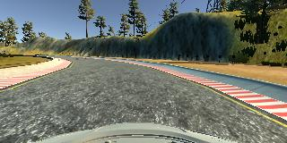|
| Shear | -0.8069155614759093 | 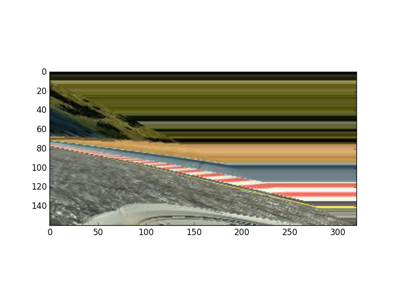|
| Crop | -0.8069155614759093| 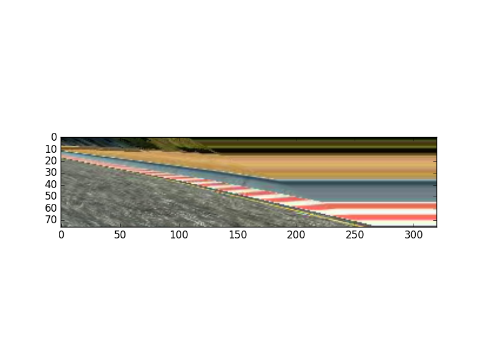|
| Resize | -0.8069155614759093| 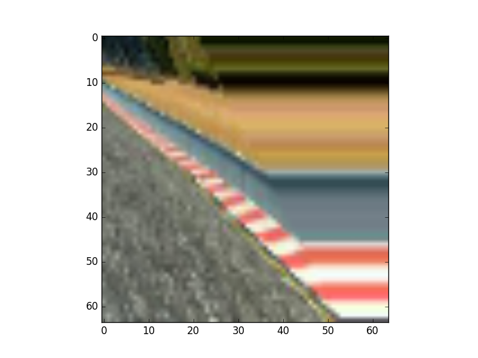|
| Shadows | -0.8069155614759093| 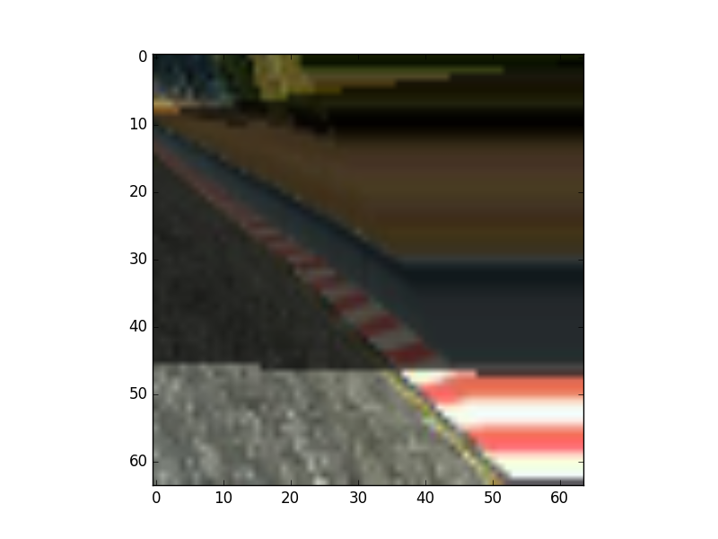|
| Flip | 0.8069155614759093| 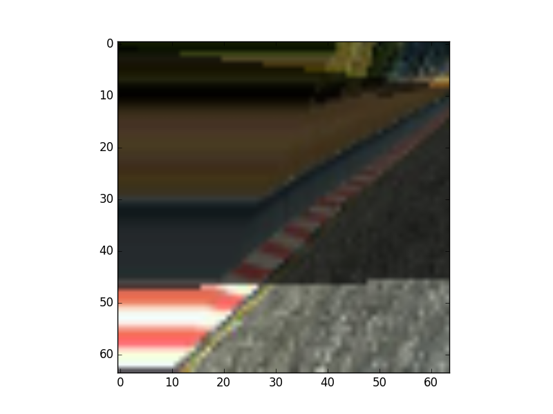|
| Brightness | 0.8069155614759093| 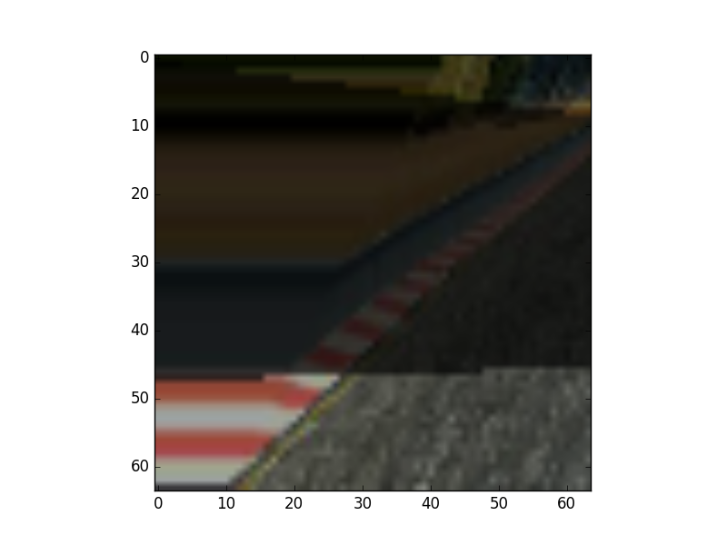|

In this case shearing introduced a high angle turn to the left, which was later converted into a right turn by the flipping
step.

The results of applying this to the training set is that the turning angles are more evenly distributed across the whole
spectrum. This can be noticed in these histograms showing the steering angles, before and after augmentation, for 10000
samples:

######Before augmentation
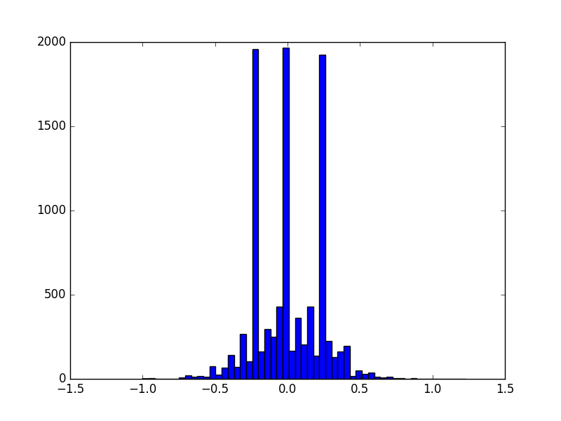

######After augmentation
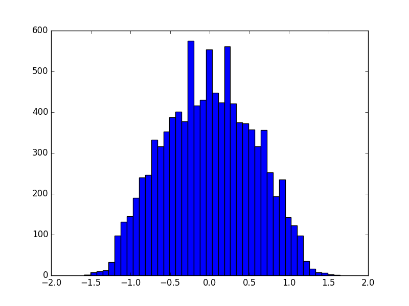

It is also noticeable in these histograms that while the data is enhanced, some driving characteristics are still in place,
shown by the three peaks in the distribution in the same places.

## Training

An Adam optimizer with an initial learning rate of .0001 is used for training. First, the training data is loaded from the
.csv file into memory, containing the center, left and right images and car telemetry including the steering angle.

This data is then shuffled and split into training and validation set. The validation set takes up 30% of the total data.
This will allow us to compare the trainig and validation loss and see when we need to modify our network or introduce dropout
or other regularization to avoid overfitting. 
The number of samples are:

```
Total samples:  8035
Training size:  5625
Validation size:  2410
```

Python generators are used to feed Keras with batches of 64 samples, instead of loading all images into memory all at once.
This also allows performing augmentation on the fly.

Using generators with Keras allows us to artificially generate epochs with more(or less) samples than the total available training
 data. I decided to use 20000 samples per epoch, for no particular reason, I just found it to be adequate. A smaller epoch
 could have possibly given finer tuning over the training.
 
## Results

The model is capable of doing several laps to circuit 1 without ever leaving the track. I have seen it go around 6 times,
but I never tried any further since I thought this was more than sufficient.
 
Click below to see the performance of the model on the first track:

[](https://www.youtube.com/watch?v=5kr1Ckof6rI&feature=youtu.be "Track 1")

The following video shows the car driving on track 2, though it gets scary a couple times the car gets to the end
of the track. I think that's pretty remarkable given that I haven't trained the model on a single image from this track!

[](https://www.youtube.com/watch?v=ddGmGxSsDPs&feature=youtu.be "Driving Sample")

I found that overfitting on the first track really makes driving in track 2 very bad, and the opposite is also true. When
the car is not able to drive very straight in track 1 it will perform a bit better in the second one. In the end I think
this amount of training is about the right balance.

## Activation visualization

By taking an example from [this repository](https://github.com/windowsub0406/Behavior-Cloning/blob/master/model.ipynb) by another student,
I decided to visualize the activation on different layers for some images, I have been curious about these visualizations
for some time.

Here are my results. For the given input:
 
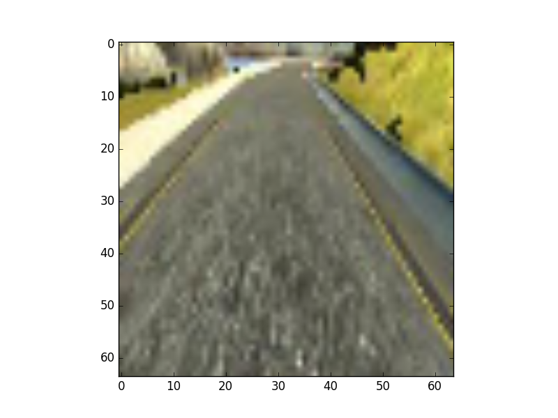

Convolutional layer 1 activations look like this: 


These look already like they are focusing on different parts of the image. After layer 2,
on the same picture, activations are these:

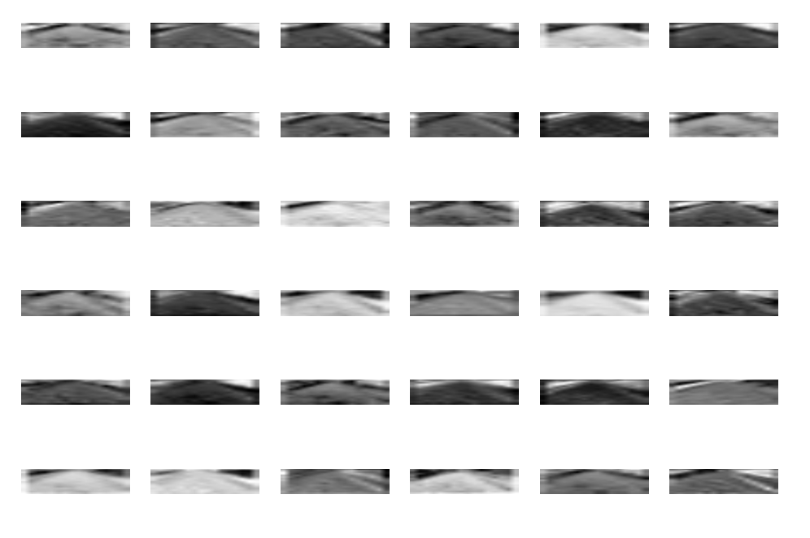

Going down to the 4th layer, now we can see more abstract features being picked up:

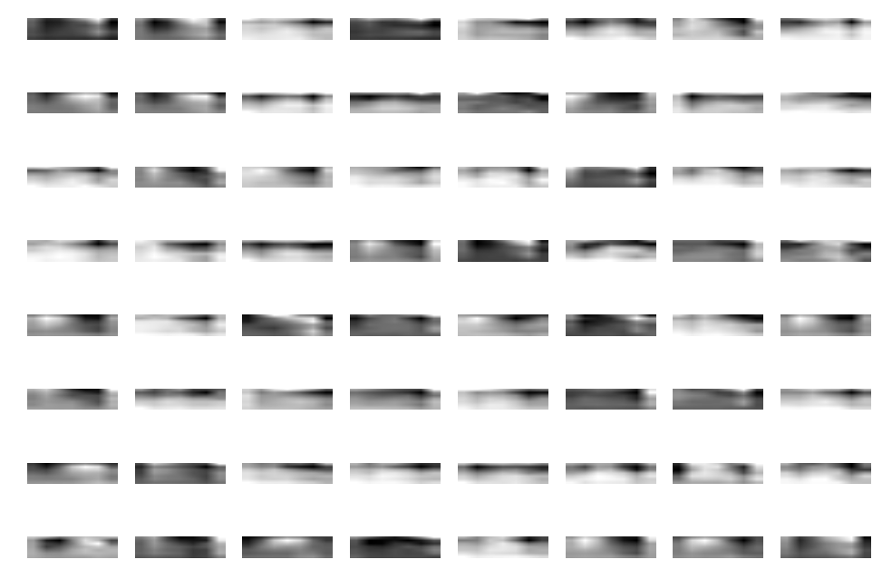

